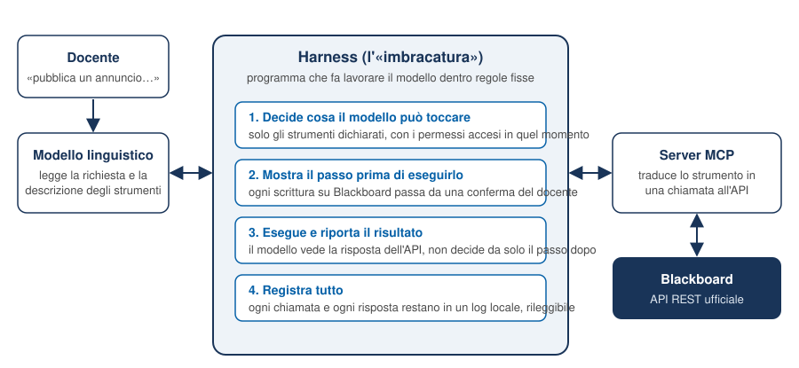
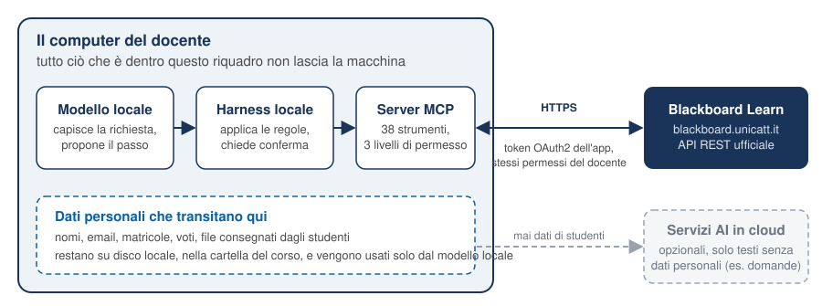
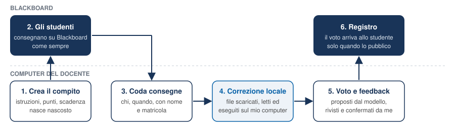

# Il contesto

Blackboard Ultra è progettato per essere usato attraverso la sua interfaccia web, a click. Per un docente che gestisce due edizioni di un corso con circa sessanta studenti ciascuna, tre appelli l'anno, esercitazioni settimanali e comunicazioni frequenti, questo comporta operazioni ripetitive (la stessa struttura di cartelle, lo stesso tipo di test, la stessa colonna di registro per ogni appello), nessuna riproducibilità (un esame creato a click non ha un "sorgente" da cui rigenerarlo o confrontarlo), una forte dipendenza dall'interfaccia (ogni riprogettazione di Ultra azzera le abitudini) e una correzione lenta dei compiti, uno alla volta.

Blackboard però espone anche un'**API REST pubblica e documentata**, pensata proprio per le integrazioni, che l'Ateneo ha attiva. Il 18 settembre 2026 l'amministrazione Blackboard della Cattolica ha registrato, su mia richiesta, un'applicazione associata al mio utente: da quel momento è possibile fare via programma ciò che faccio a mano nell'interfaccia, con le stesse identiche autorizzazioni.

A quanto mi risulta sono il primo docente dell'Ateneo a usare questo canale per la didattica quotidiana. Per questo ho ritenuto corretto documentare cosa ho costruito, come, e con quali garanzie, prima di renderlo pubblico.

# Cos'è, in parole semplici

## Tre parole: modello, harness, strumenti

Un **modello linguistico** è un programma che legge un testo e produce un testo. Da solo non può fare nulla: non apre file, non manda richieste, non tocca Blackboard. Capisce una richiesta come "pubblica un annuncio che ricorda il ricevimento di lunedì" e sa proporre il passo successivo.

L'**harness** (letteralmente "imbracatura") è il programma che fa lavorare il modello dentro regole fisse. Decide quali strumenti il modello può vedere, mostra ogni passo prima di eseguirlo, lo esegue solo se il docente conferma, riporta il risultato al modello e registra tutto in un log locale. Le regole stanno nell'harness, non nel modello: è questa la garanzia.

Gli **strumenti** sono funzioni con un nome, una descrizione e dei parametri: "elenca gli iscritti", "crea un compito con questi punti e questa scadenza", "scarica i file consegnati per questa consegna". Il modello li invoca come si invoca una funzione. Lo standard con cui un harness scopre gli strumenti di un programma esterno si chiama **MCP** (Model Context Protocol), uno standard aperto adottato dai principali produttori di assistenti.

{width=100%}

## Cos'è questo server

`mcp-blackboard-ucsc` è un server MCP: un programma di poche centinaia di righe che espone **74 strumenti** per Blackboard Ultra della Cattolica.

| Area | Cosa fa |
|---|---|
| Account e corso | chi sono, quali corsi vedo, chi è iscritto (nome, email, matricola) |
| Contenuti | albero completo del corso, lettura e modifica di documenti e cartelle, caricamento file |
| Annunci | elenco, pubblicazione, modifica, cancellazione |
| Esami | elenco dei test, creazione della struttura, generazione del file domande per Ultra |
| Compiti | creazione con punti e scadenza, coda delle consegne da correggere, download dei file consegnati, voto per singola consegna |
| Registro | tutte le colonne, tutti i voti, esportazione CSV, voti per studente, registro delle modifiche |
| Partecipazione | quanto del corso ogni studente ha aperto, presenze alle lezioni |
| Rubriche | griglie di valutazione per criterio, compilate per ogni consegna |
| Rilascio condizionato | materiale visibile per data, per gruppo, per voto ottenuto |
| Eccezioni | scadenza o tentativi diversi per un singolo studente |
| Forum e calendario | discussioni, risposte, eventi del corso |
| Gruppi e copia corso | gruppi di progetto con consegna unica, prenotazione ricevimenti, copia della struttura tra edizioni |
| Verbalizzazione | compilazione del file Excel di SVE con i voti del registro |

In pratica: apro l'assistente nella cartella del corso e scrivo, in italiano, "prepara il primo intermedio dalla banca domande e mettilo nascosto nella cartella esami". L'assistente traduce la richiesta nelle chiamate giuste, mi mostra cosa sta per fare, lo fa, e mi riporta cosa ha risposto Blackboard.

# Rispetto dei dati di studenti e docenti

È il punto che ritengo più importante e su cui ho preso le decisioni progettuali più nette.

## Il ragionamento avviene in locale

I dati che questo strumento maneggia sono dati personali: nomi, email, matricole, voti, file consegnati dagli studenti. Per questo il modello linguistico che li legge è **eseguito sul computer del docente**, non su un servizio remoto. Esistono oggi modelli aperti di qualità sufficiente per questi compiti, che girano su un normale portatile, e harness locali che li fanno lavorare con gli strumenti MCP. Nessun dato di studente viene inviato a fornitori esterni di intelligenza artificiale.

Servizi AI in cloud possono essere usati, opzionalmente, solo per attività **prive di dati personali**: abbozzare le domande di un esame, riformulare il testo di un annuncio. Anche in quei casi il testo che parte non contiene nomi, voti né consegne. La distinzione è una regola di lavoro, non una possibilità tecnica lasciata al caso.

{width=84%}

## Nessun accesso nuovo, nessun trattamento nuovo

Lo strumento usa un'applicazione registrata dall'amministrazione Blackboard e **vincolata al mio utente**. Vede ciò che vedo io, può fare ciò che posso fare io, e nulla di più: non è amministratore, non accede ad altri corsi, non legge dati di sistema. Le uniche credenziali sono la chiave e il segreto dell'applicazione, custoditi in un file locale escluso dal controllo di versione e mai pubblicati.

I dati che il docente legge attraverso l'API sono gli stessi che legge nell'interfaccia: la base giuridica e le finalità del trattamento non cambiano, cambia lo strumento con cui il docente vi accede. Il titolare del trattamento resta l'Ateneo; il docente continua a operare nel proprio ruolo.

## Cosa resta su disco e per quanto

I file consegnati dagli studenti vengono scaricati, per la correzione, in una cartella locale del corso su un disco cifrato, e cancellati a fine anno accademico insieme agli altri materiali di correzione, come già avviene per i compiti scaricati a mano. L'esportazione del registro in CSV segue la stessa regola. Il log dell'harness, che registra ogni chiamata, resta anch'esso locale.

## Tre livelli di permesso e "tutto nasce nascosto"

Il rischio di un'automazione su un sistema vivo è che un errore raggiunga gli studenti. Il server ha quindi tre interruttori indipendenti:

1. **Lettura** — sempre attiva. Vedere contenuti, iscritti, voti non modifica nulla.
2. **Scritture** — spente di default. Creare o modificare contenuti, annunci, test, compiti, colonne richiede un'abilitazione esplicita.
3. **Voti** — un terzo interruttore, separato, per pubblicare un voto: un numero sbagliato nel registro ufficiale è l'errore che arriva più direttamente allo studente.

Inoltre tutto ciò che viene creato **nasce nascosto** agli studenti: cartelle, documenti, test, compiti. Renderli visibili è un passo esplicito e separato, che il docente conferma. E i testi degli annunci vengono controllati prima dell'invio contro il sottoinsieme di HTML che Blackboard accetta, perché il sistema rifiuta il tag sbagliato senza indicare quale.

# Come è fatto

Tre file Python, nessun framework oltre alla libreria ufficiale MCP e a un client HTTP:

- `client.py` — autenticazione, invio delle richieste, paginazione, controllo del markup. Ottiene un token OAuth2 con le credenziali dell'applicazione, lo tiene in cache per un'ora e lo rinnova da solo se una chiamata risponde 401.
- `export.py` — genera il file di domande nel formato che Ultra accetta in *Upload Questions* (una domanda per riga, massimo 250).
- `server.py` e `tools_more.py` — i 74 strumenti, uno per funzione, ciascuno con la descrizione in linguaggio naturale che l'assistente legge per capire quando usarlo.

Un limite scoperto lungo la strada merita una riga: su Ultra l'API pubblica non permette di leggere né scrivere il testo delle domande di un test. Ciò che Ultra accetta è un file caricato dall'interfaccia. Quindi per un esame il server crea la struttura del test e genera il file; il caricamento resta un click del docente, e il file è il "sorgente" riproducibile dell'esame.

# Come lo sto costruendo

## Metodo

Ogni strumento nasce da una verifica in tre tappe. Prima il **riferimento della build**: Blackboard pubblica la specifica dell'API per ogni versione, e la Cattolica è alla 4000.21.0; leggo lì quali rotte esistono e con quali campi. Poi una **sonda in sola lettura sul sito reale**, per vedere cosa la rotta risponde davvero (spesso meno di quanto dichiara la documentazione). Infine **test automatici contro un'API simulata**, senza rete: ogni strumento ha almeno un test che descrive prima il comportamento atteso e poi lo verifica. Oggi sono 68 e girano in meno di un secondo.

Le scritture sono la parte delicata: le provo con uno script apposito che lavora in una cartella nascosta e su un annuncio in bozza, riporta quali rotte rispondono correttamente, e cancella tutto ciò che ha creato.

## Cronologia

| Data | Passo |
|---|---|
| 15 settembre | Prima analisi. La sessione del browser non autentica l'API: serve un'applicazione registrata dall'amministrazione. Individuati i corsi 2025-26 e 2026-27. |
| 16 settembre | Verifica delle rotte contro la specifica. Le domande sono opache su Ultra: il file *Upload Questions* è la via. Prime scritture confermate (annuncio, visibilità cartelle). |
| 18 settembre | L'amministrazione registra l'applicazione. Riscrittura sul token dell'applicazione: 26 strumenti, iscritti con nome ed email, albero del corso, registro con nomi. |
| 20 settembre | Dodici strumenti per compiti, correzione, annunci e registro. Corretto un errore nel caricamento file. 35 test. |
| 21 settembre | Rilettura completa della specifica (198 rotte): 35 strumenti per partecipazione, presenze, rubriche, rilascio condizionato, eccezioni, forum, calendario, gruppi, copia corso. Analisi di SVE e ponte per la verbalizzazione, provato sul file reale di un appello. 68 test. Questa nota. |

## Stato di verifica

| Verificato sul sito reale | Nella specifica, da provare con lo script delle scritture |
|---|---|
| lettura di corsi, iscritti, albero contenuti, annunci, test, colonne, voti, tentativi, file consegnati, voti per studente, partecipazione, presenze, rubriche, regole di rilascio, eccezioni, forum, calendario, registro delle modifiche, ricevute, gruppi | creazione compito, modifica colonna, modifica e cancellazione annuncio, cancellazione contenuto, caricamento file, voto per consegna |
| pubblicazione annuncio, modifica visibilità, creazione cartella e documento | presenze, rubriche, regole di rilascio, eccezioni, forum, calendario, gruppi, copia corso (tutte le scritture del secondo insieme) |
| — | inserimento domande via API (atteso in errore: su Ultra è il file) |

# Come lo userò

## Annunci

Chiedo all'assistente di scrivere l'annuncio; il server controlla il markup, lo pubblica o lo salva come bozza se voglio rileggerlo in Ultra. Un refuso si corregge con una modifica, senza cancellare e ripubblicare. Blackboard notifica gli studenti secondo le loro impostazioni, esattamente come per un annuncio fatto a mano.

## Esami da un template riproducibile

Le domande del corso vivono in un file di testo strutturato, per argomento, nel repository del corso. Ogni appello si genera da lì: scelgo o pesco le domande con criteri espliciti (tante per argomento, senza ripetere quelle dell'appello precedente); il server valida ogni domanda, crea il test nascosto nella cartella giusta e scrive il file per *Upload Questions*; in Ultra carico il file e imposto punti, durata e rilascio dei risultati; il giorno dell'appello rendo il test visibile. Il sorgente dell'esame è così un file versionato: posso confrontare due appelli, rigenerare quello dell'anno precedente, sapere quali domande sono già uscite.

## Compiti e correzione

Qui il guadagno di tempo è maggiore, e qui la scelta del modello locale conta di più, perché il modello legge le consegne degli studenti.

{width=100%}

Il compito viene creato con istruzioni, punti, scadenza e numero di tentativi in una sola chiamata, già con la sua colonna di registro, e rilasciato quando decido. Dopo la scadenza la coda mi dice chi ha consegnato e quando. I file (relazioni, script R) vengono scaricati in locale; il modello li legge con me, esegue il codice, confronta con la soluzione e propone voto e feedback, che rivedo. Il voto viene registrato sulla singola consegna e resta in sospeso finché non ho finito tutti; la pubblicazione è un passo separato. Il registro completo si esporta in CSV per le mie analisi.

## Registro e monitoraggio

In qualsiasi momento posso chiedere come sta andando uno studente su tutte le colonne, chi non ha ancora consegnato, o l'esportazione del registro. Proprio preparando questa nota, la coda delle correzioni ha segnalato una consegna dell'appello del 10 settembre 2026 ancora senza voto. Il registro delle modifiche (chi ha cambiato quale voto, quando) e le ricevute di consegna chiudono in un comando le contestazioni.

## Partecipazione e presenze

Blackboard registra quanti materiali ogni studente ha aperto: letto in modo sistematico, e incrociato con consegne e voti, è il segnale precoce più affidabile di uno studente in difficoltà, disponibile settimane prima del primo esame. Lo strumento Presenze, oggi inutilizzato nel corso, diventa praticabile: una lezione registrata in un comando, i presenti segnati da una lista (foglio, QR, appello), il registro delle presenze tenuto da Blackboard e non da me.

## Rubriche, rilascio condizionato, eccezioni

Tre funzioni che a click sono lente e quindi poco usate. Una **rubrica** (criteri per righe, livelli per colonne, punti per cella) si crea da una tabella e si compila per ogni consegna: il modello locale propone la cella per ogni criterio, io confermo, lo studente riceve un feedback strutturato e lo stesso metro vale per tutti. Il **rilascio condizionato** rende un materiale visibile solo a chi soddisfa una condizione: una data, un gruppo, un voto (per esempio il materiale di recupero solo a chi ha preso meno di 18 all'intermedio, coerente con il percorso a due vie del corso). Le **eccezioni** danno a un singolo studente una scadenza o un numero di tentativi diverso senza toccare il compito per tutti: è la via corretta per gli accomodamenti (DSA, Erasmus, malattia).

## Verbalizzazione e ricevimento di visione compiti

La verbalizzazione avviene su **SVE** (`secure.unicatt.it/sve`), che non ha un'API ma offre, nella pagina *Registra voti*, l'esportazione di un file Excel con gli iscritti all'appello e la sua reimportazione con la colonna *Voto Finale* compilata. Lo strumento riempie quella colonna dai voti del registro Blackboard, abbinando per matricola, con regole esplicite (arrotondamento, lode, insufficienza) e un rapporto delle discordanze: chi è iscritto all'appello ma non ha voto, chi ha un voto ma non è iscritto. La finestra utile è precisa: l'importazione è possibile finché l'appello è in *Registrazione voto*, e si chiude con l'*Inoltro alla firma*, dopo il quale una correzione passa dalla *Rettifica voti* a mano. L'ordine corretto è quindi: correzione in Blackboard, visione dei compiti, generazione e importazione del file, e solo allora l'inoltro. Il caricamento del file, il controllo della colonna *Errore* che SVE mostra prima di salvare, l'*Inoltro alla firma* e la **firma** restano atti manuali del docente: è il punto in cui il controllo umano è dovuto, e non va automatizzato.

Tra correzione e verbalizzazione sta la visione dei compiti. La sequenza che intendo seguire: voti pubblicati su Blackboard con feedback; annuncio con la finestra di ricevimento; **prenotazione degli slot** tramite gruppi a iscrizione autonoma con posti limitati (una funzione nativa di Blackboard, creata in un comando), che mi dice chi viene e quando; eventuali rettifiche sul registro; solo dopo, il file per SVE.

## Forum, calendario, gruppi, copia corso

Le domande nel forum del corso si leggono con gli autori e si riassumono in una risposta pubblicata, o in una FAQ settimanale. Il calendario del corso, oggi vuoto, si popola dal calendario che già mantengo per il sito. I gruppi di progetto si formano da un foglio con vincoli di composizione, con consegna e voto unici per gruppo. La struttura del corso 2025-26 si copia in quella del 2026-27 scegliendo cosa portare (contenuti, rubriche, calendario, regole), e la stessa impalcatura vale per il corso condiviso con il co-docente.

# Pubblicazione con licenza aperta

Intendo pubblicare il codice con **licenza MIT** in un repository pubblico. Il repository contiene il codice, i test, la documentazione e questa nota. **Non contiene** credenziali (il file che le custodisce è escluso dal controllo di versione fin dal primo giorno), né dati di studenti, né materiali di correzione, né esami. Gli identificativi dei corsi che compaiono negli esempi sono quelli dei miei corsi e non danno accesso ad alcunché senza un'applicazione registrata dall'Ateneo.

Le ragioni sono tre. La prima è la **trasparenza verso l'Ateneo**: chiunque, in Cattolica, può leggere esattamente cosa lo strumento fa e cosa non fa. La seconda è l'**utilità per altri docenti**: Blackboard Ultra è usato in centinaia di università, e lo strumento è riutilizzabile ovunque cambiando un indirizzo e una coppia di credenziali. La terza è la **verificabilità delle scelte sui dati**: le garanzie descritte al capitolo 3 non sono una dichiarazione, sono righe di codice che chiunque può controllare.

# Limiti noti

- **Domande dei test**: l'API non le legge né le scrive su Ultra; il file *Upload Questions* è la via, e i punti non viaggiano nel file.
- **Risposte degli studenti ai test**: i tentativi espongono voto, stato e date, non le risposte, che restano nella vista di correzione di Ultra. I file dei compiti invece sì.
- **Durata, tentativi e rilascio dei risultati di un test** non passano dall'API.
- **Annunci**: nessuna opzione "invia anche per email" via API. **Messaggi diretti** agli studenti: non esposti per i corsi Ultra.
- **Scala in trentesimi con lode** come schema di voto: creabile via API solo nei corsi Original; su Ultra resta un'impostazione manuale.
- **Nessun accesso amministrativo**, ed è corretto così.

# Cosa chiedo all'Ateneo e prossimi passi

Chiedo una **presa d'atto** di questa iniziativa e, se ritenuto utile, un confronto con i referenti Blackboard di Facoltà e con il responsabile della protezione dei dati, per verificare che le scelte descritte al capitolo 3 siano allineate alle policy di Ateneo. Sono disponibile a presentare lo strumento e a condividerlo con i colleghi interessati.

Da parte mia, i prossimi passi sono: completare la verifica delle scritture sul corso 2026-27 con lo script descritto; costruire la banca domande e generare da lì il primo intermedio di ottobre; usare il flusso dei compiti sulle prime esercitazioni dell'autunno e misurare il tempo di correzione risparmiato; pubblicare il repository.

*Contatti: niccolo.salvini@unicatt.it*
